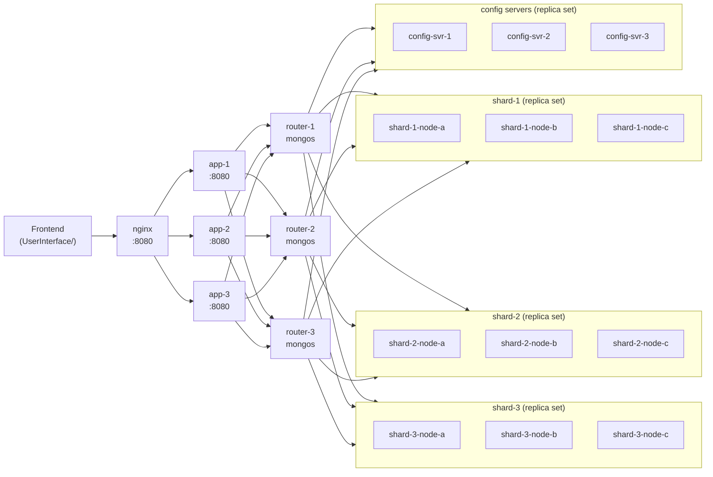
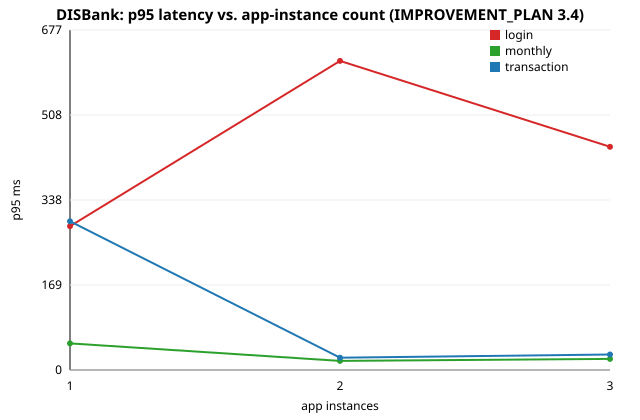

[](https://github.com/NikhilBayyavarapu/CSE512_Final_Project/actions/workflows/ci.yml)

# DISBank

A horizontally-scalable mock banking API on a sharded, replicated MongoDB cluster — built
for CSE512 (distributed systems) to measure how throughput and latency change as you add
stateless app instances and shards.

> Demo GIF: pending (see 4.3 in `IMPROVEMENT_PLAN.md`).

## Architecture



The app tier is stateless — every instance is an identical Go binary, and all coordination
happens in MongoDB. `nginx` round-robins across `app-1/2/3`; scaling horizontally means
adding more app services and nginx upstream entries, no app-side changes.

## Quickstart

```bash
docker compose up -d --build   # brings up config servers, 3 shard replica sets, 3 routers,
                                # seeds the cluster, and starts 3 app instances behind nginx
curl http://localhost:8080/health   # liveness
curl http://localhost:8080/ready    # readiness (pings Mongo)
```

The frontend (`UserInterface/`) talks to `http://localhost:8080` by default — serve it with
`npx http-server UserInterface/` and open the printed URL, or just hit the API directly.

Prometheus is at `http://localhost:9090`, Grafana (with a pre-provisioned dashboard) at
`http://localhost:3001`.

See `SETUP.md`/`CODE.md` for the full manual bring-up (useful if you want to understand or
tweak the cluster topology) and `CLAUDE.md` for the codebase layout and operational notes.

## Benchmarks

`responsetime/main.go` is a CLI load-testing harness (`-test=login|transaction|monthly`,
`-workers`, `-n`, `-base-url`, `-instances`) that logs p50/p95/p99 latency and appends a row
to `benchmarks/results.csv` per run. `make bench` runs it; `benchmarks/chart.go` renders
`benchmarks/scaling.svg` from the accumulated CSV.



Sweeping 1 → 3 app instances (20 workers, 500 requests/scenario) showed `transaction` and
`monthly` p95 latency drop sharply from 1 → 2 instances; `login` (bcrypt-bound, CPU-heavy) was
noisier and didn't scale as cleanly at this sample size — reported as observed, not smoothed.

## Trade-offs

- **Hashed shard keys** (`sender_id`/`receiver_id`) give an even write distribution across
  shards, at the cost of `sender_id`-filtered reads becoming scatter-gather across all shards
  instead of routing to one.
- **Secondary reads for transaction history** (`readpref.Secondary()`, local read concern)
  trade strict consistency for read throughput — history can lag the primary briefly. Balance
  reads during a transfer use the primary with majority concern instead, since staleness there
  is a correctness bug, not a UX nit.
- **Conditional `$inc` for debits** (`current_balance >= amount` as part of the update filter)
  gives lock-free, race-free balance checks — no read-then-write window — at the cost of a
  slightly less obvious failure mode (`MatchedCount == 0` means "insufficient funds", not "not
  found").

## What I'd do next

- Make shard count and app-instance count independently configurable (today both are fixed at
  3 in `docker-compose.yml`/`scripts/init/init-cluster.sh`) so the benchmark sweep can cover
  1→6 instances × 1→3 shards independently, per the original plan.
- Add alerting rules and SLOs on top of the Prometheus metrics, not just a dashboard.
- Deploy the static frontend against a configurable backend URL for a live demo instead of
  just a GIF.

## Legacy / manual path

Before `docker-compose.yml` existed, this cluster was brought up by hand with `scripts/*.sh`
and seeded via MongoDB Compass. That path still works and is documented in `SETUP.md`/
`CODE.md`, but the compose flow above is the maintained one.
